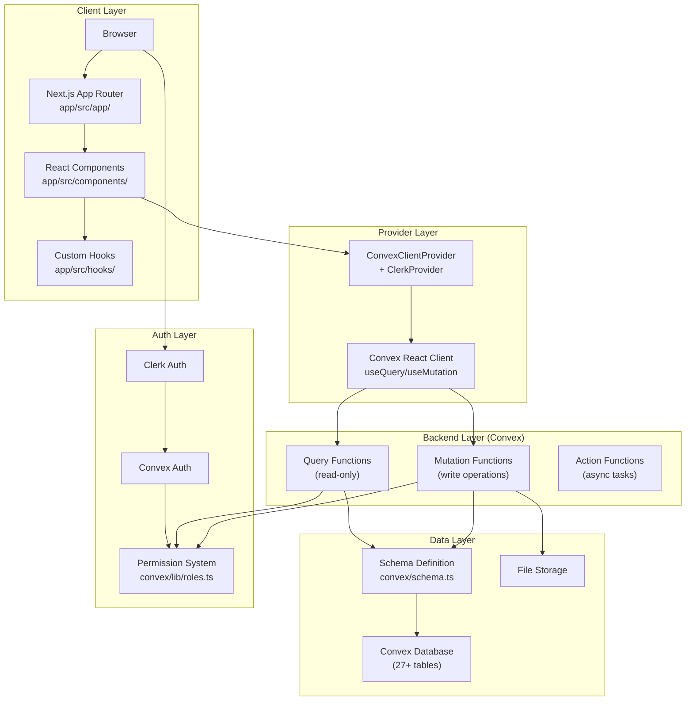
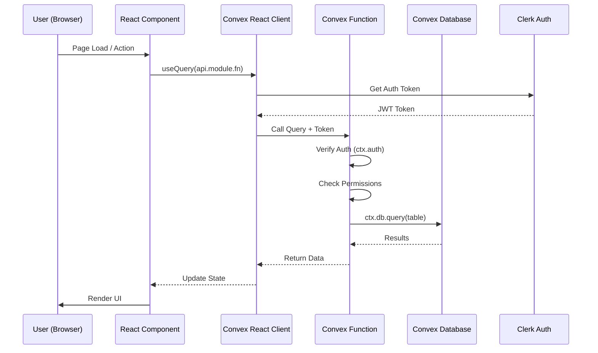

# Architecture

**Analysis Date:** 2026-01-16

## Pattern Overview

**Overall:** Full-Stack BaaS (Backend-as-a-Service) Application

**Key Characteristics:**
- Next.js App Router for frontend with React Server Components
- Convex serverless functions for backend (no traditional REST API)
- RPC-style API calls via Convex React client
- Real-time data subscriptions via `useQuery`
- Clerk + Convex Auth for authentication

## Architecture Diagram

## Layers

**Presentation Layer:**
- Purpose: Render UI and handle user interactions
- Contains: React components, page routes, layouts
- Location: `app/src/app/` (pages), `app/src/components/` (48+ components)
- Depends on: Provider layer for data access
- Used by: Browser (end users)

**Provider Layer:**
- Purpose: Connect frontend to backend, manage auth state
- Contains: `ConvexClientProvider`, Clerk provider wrappers
- Location: `app/src/components/ConvexClientProvider.tsx`
- Depends on: Convex SDK, Clerk SDK
- Used by: All components needing data/auth

**Backend Layer (Convex Functions):**
- Purpose: Business logic, data validation, access control
- Contains: Query, Mutation, and Action functions (23 modules)
- Location: `app/convex/*.ts`
- Depends on: Data layer, Auth layer
- Used by: Provider layer via RPC calls

**Data Layer:**
- Purpose: Persistent storage, schema definition
- Contains: Table definitions, indexes, search indexes
- Location: `app/convex/schema.ts`
- Depends on: Convex platform
- Used by: Backend layer

**Auth Layer:**
- Purpose: Identity management, permissions
- Contains: Clerk integration, role-based access control
- Location: `app/convex/auth.ts`, `app/convex/lib/roles.ts`, `app/convex/permissions.ts`
- Depends on: Clerk service
- Used by: All layers

## Data Flow

**Client Query Flow:**

**State Management:**
- Server state: Managed by Convex (real-time subscriptions)
- Client state: React `useState` for local UI state
- No external state library (Redux, Zustand, etc.)

## Key Abstractions

**Convex Module:**
- Purpose: Encapsulate domain logic (documents, forms, messages, etc.)
- Examples: `app/convex/documents.ts`, `app/convex/forms.ts`, `app/convex/channels.ts`
- Pattern: Exports queries, mutations, actions per domain
- API: `api.module.functionName` via `_generated/api`

**Permission System:**
- Purpose: Role-based access control
- Server: `app/convex/lib/roles.ts` defines roles (staff, manager, admin)
- Server: `app/convex/permissions.ts` provides permission checks
- Client: `app/src/hooks/usePermissions.ts` for UI access control
- Pattern: `canUserPerform(ctx, action)` / `usePermissions().can(action)`

**Schema Tables:**
- Purpose: Define data structure and indexes
- Location: `app/convex/schema.ts`
- Pattern: `defineTable()` with fields, indexes, search indexes
- Tables: documents, userProfiles, formSchemas, messages, channels, etc.

## Entry Points

**Frontend Entry:**
- Location: `app/src/app/layout.tsx`
- Triggers: Browser navigation
- Responsibilities: Set up providers, render layout shell

**Page Routes:**
- Location: `app/src/app/[route]/page.tsx`
- Triggers: URL navigation
- Responsibilities: Fetch data, render page content

**Backend Entry:**
- Location: `app/convex/*.ts` module exports
- Triggers: `useQuery`/`useMutation` calls from client
- Responsibilities: Validate, authorize, execute business logic

## Error Handling

**Strategy:** Try/catch with user-friendly error messages

**Patterns:**
- Backend: Throw errors in Convex functions, caught by client
- Frontend: Try/catch in mutation handlers, display toast/alert
- Validation: Convex schema validation via `v.string()`, `v.number()`, etc.

## Cross-Cutting Concerns

**Logging:**
- Console.log for debugging
- No structured logging framework

**Validation:**
- Convex values (`v.string()`, `v.id()`, etc.) at function boundaries
- No additional schema validation (Zod, Yup)

**Authentication:**
- Clerk middleware protects routes
- Convex functions check `ctx.auth.getUserIdentity()`
- Permission checks via `permissions.ts` helpers

---

*Architecture analysis: 2026-01-16*
*Update when major patterns change*
