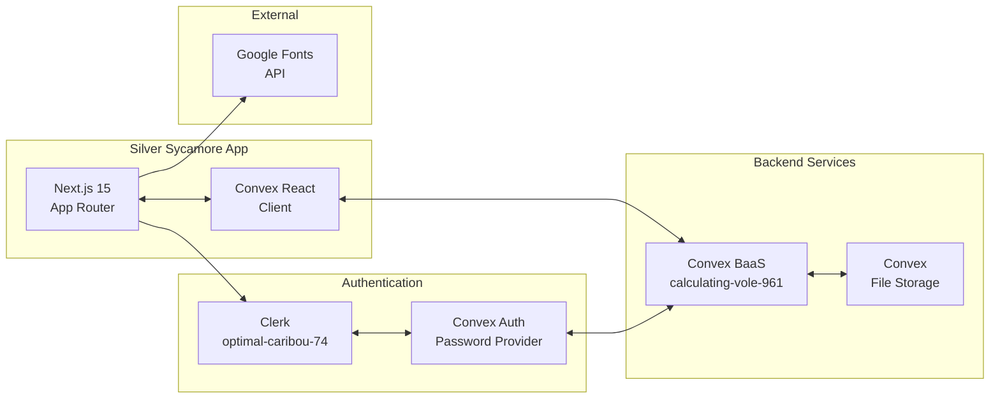

# External Integrations

**Analysis Date:** 2026-01-16

## APIs & External Services

### Integration Map

## Data Storage

**Databases:**
- Convex Cloud Database - Primary data store
  - Connection: `CONVEX_URL` env var (via `convex.json`)
  - Client: Convex SDK (`convex/react`)
  - Schema: `app/convex/schema.ts` (27+ tables)
  - Deployment: `calculating-vole-961.convex.cloud`

**File Storage:**
- Convex File Storage - User uploads, attachments
  - Client: `ctx.storage` in Convex functions
  - Table: `files` with `storageId` reference to `_storage`

**Caching:**
- None currently (all queries hit Convex directly)

## Authentication & Identity

**Auth Provider (Primary):**
- Clerk - OAuth/JWT authentication
  - Implementation: `@clerk/nextjs` SDK
  - Config: `app/convex/auth.config.ts`
  - Environment: `optimal-caribou-74.clerk.accounts.dev`
  - Env vars: `NEXT_PUBLIC_CLERK_PUBLISHABLE_KEY`, `CLERK_SECRET_KEY`, `CLERK_JWT_ISSUER_DOMAIN`

**Auth Provider (Secondary):**
- Convex Auth - Password-based authentication
  - Implementation: `@convex-dev/auth` ^0.0.90
  - Config: `app/convex/auth.ts`
  - Provider: Password authentication for staff users

**Session Management:**
- Clerk JWT tokens validated by Convex backend
- `ConvexProviderWithClerk` wrapper in `app/src/components/ConvexClientProvider.tsx`
- Middleware: `clerkMiddleware` in `app/src/proxy.ts`

## Monitoring & Observability

**Error Tracking:**
- None detected (no Sentry, Datadog, etc.)

**Analytics:**
- None detected

**Logs:**
- Console logging only
- Vercel logs for production (stdout/stderr)

## CI/CD & Deployment

**Hosting:**
- Vercel - Next.js deployment (`.vercel/project.json` present)
  - Deployment: Automatic on git push (presumed)
  - Environment vars: Configured in Vercel dashboard

**CI Pipeline:**
- Not detected (no `.github/workflows/` found)

## Environment Configuration

**Development:**
- Required env vars: `CONVEX_URL`, `NEXT_PUBLIC_CLERK_PUBLISHABLE_KEY`, `CLERK_SECRET_KEY`
- Secrets location: `app/.env.local` (gitignored)
- Mock/stub services: Clerk test mode for E2E tests

**Production:**
- Secrets management: Vercel environment variables
- Convex deployment: Production instance on Convex cloud

## Webhooks & Callbacks

**Incoming:**
- Clerk Auth callbacks - `app/convex/http.ts`
  - Delegates to Convex Auth HTTP router
  - Events: User sign-up, sign-in callbacks

**Outgoing:**
- None detected

## External Fonts/CDN

**Google Fonts API:**
- Loaded in: `app/src/app/layout.tsx`
- Fonts: DM Sans (body), Playfair Display (display)
- Preconnect: `fonts.googleapis.com`, `fonts.gstatic.com`

---

*Integration audit: 2026-01-16*
*Update when adding/removing external services*
